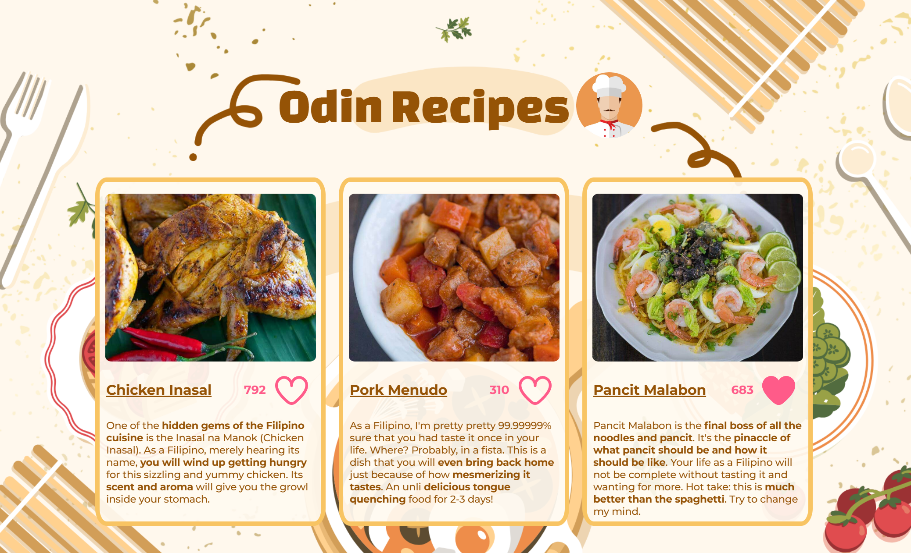
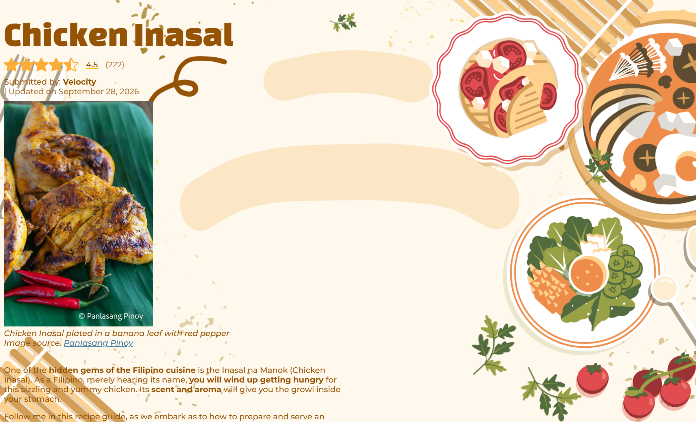
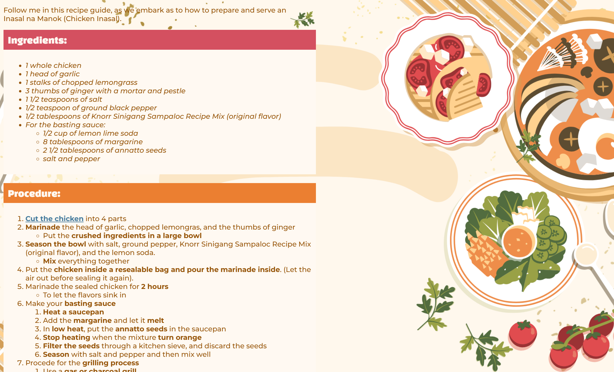
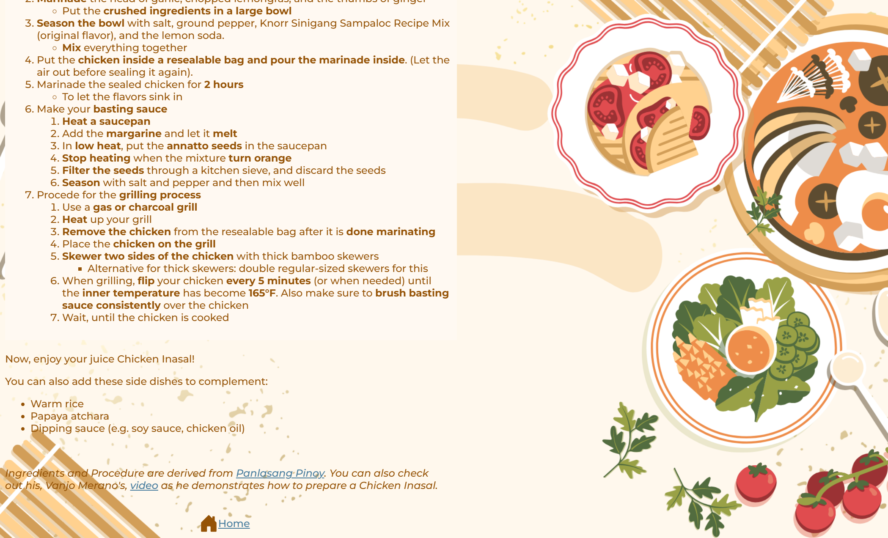
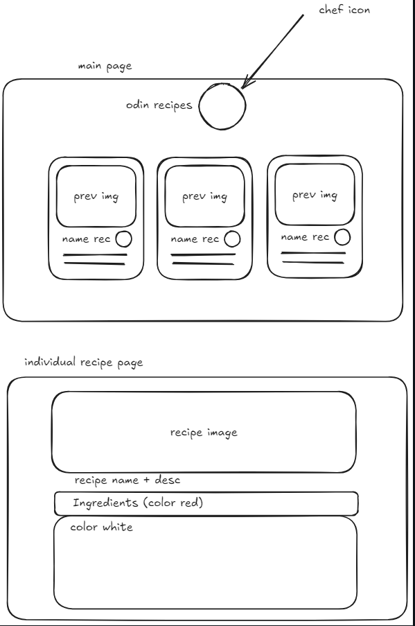

# Odin Recipes 🍲📖🥣
In this project, you will be able to see various **Filipino recipes** that the folks enjoyed
  
Here, you can observe the skills I have developed so far in my Web Development journey:
- elements and tags
- html boilerplate
- lists 
- links and images
- working with text
- the use of code editor for efficiency
- use of paths in the website 
- using command line for navigation and program execution needed for testing the website
- use of git (evident here)

Alongside some CSS, I had learned prior to taking the Odin Project
  

# New Design Update 🔔
For this update, I have added Cascading Style Sheets (CSS) as [instructed](https://www.theodinproject.com/lessons/foundations-block-and-inline) by The Odin Project curriculum. Although, I already added CSS way before (because it looks so bland). I think my CSS skill had improved in contrast from the last time I programmed this project.

So, let me showcase the project, can't we?

Before this, I had planned the layout using excalidraw:

At first, I struggled as to how to make that Pokemon type of card in the main landing page because I did not understand `display: flex;` at first, but I think a few Google searches helped me to reconcile with this challenge xd. The Odin Project, indeed, supercharge my development because I learned about the flow of the elements whether vertical or horizontal flow through `inline` and `block` display type . I also used `div` here a lot which is a mystery to me before I start The Odin Project. Even though, I haven't touched the `flex` in the curriculum, I learned about it easily, and I think continuing with the curriculum, I will understand it even more.

CSS made me turn what is in my imagination into reality. 

At the recipe's individual page, you can see me deviate a little from my imagined layout. It is because I think that the rightmost part filled the whitespace already. Gosh, thanks to my teacher and the Empowerment Technology subject the UI looks somehow decent (at least in my point of view).

# Realizations 💡
- I realized that HTML is just like editing in Microsoft Word or Powerpoint and then making things beautiful
- Use .PNG always! No more debate. It's because weird things happened with .JPG
- Filepath is super important when deploying a website, weird things can happen (Use relative path as much as possible if linking innate to the website)

# Acknowledgements 📦
- Super thanks to Sir Vanjo Merano of [Panlasang Pinoy](https://panlasangpinoy.com/). This project would not exist without his recipes.
- Thank you to Magnific for letting me use their image as an [icon](https://www.magnific.com/icon/recipe-book_7398601), especially to the creator [Andrean Prabowo](https://www.magnific.com/author/anconerdesign/icons) 
- The background image of this website will not be possible without [Canva](https://canva.com/)
- [Chef icon ](https://www.vectorstock.com/royalty-free-vector/professional-chef-icon-vector-7497725)was from [Alliya2000](https://www.vectorstock.com/royalty-free-vectors/vectors-by_Alliya2000). Huge thanks btw. It upgrades and complemented the webpage the way I imagined it to be.
- The heart effect made by [catraco](https://uiverse.io/profile/catraco) can be found in [UIverse](https://www.vectorstock.com/royalty-free-vector/professional-chef-icon-vector-7497725). Huge thanks also btw. I don't have to make it from scratch.
- [Bootstrap's icons](https://icons.getbootstrap.com/icons/) had been a game-changer for this project although they are small, they perfectly fit in the webpages.
- For the heading of the individual recipe pages. [AllRecipes](https://www.allrecipes.com/recipe/283215/salted-caramel-apple-pie/#icon-star) has been my go-to for the inspiration.